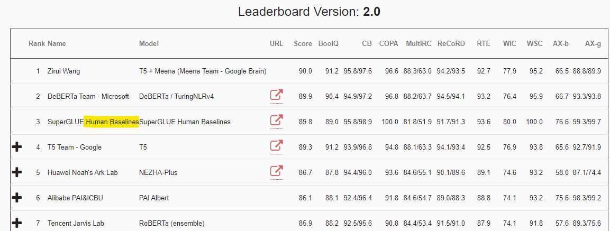
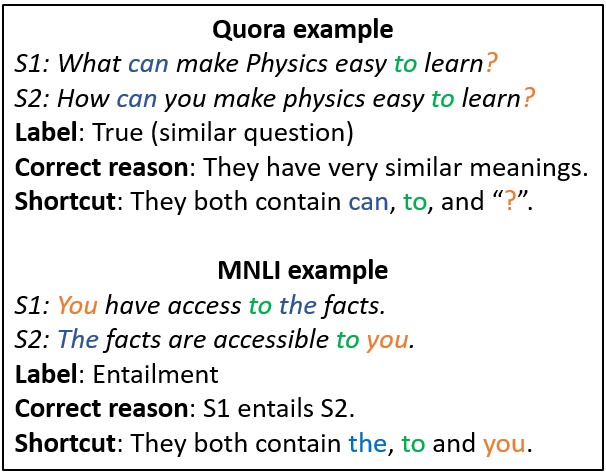

# Introduction to Interpretable NLP
## Zining Zhu, Frank Rudzicz

University of Toronto Computer Science

---
# Current DNN-based NLP systems are good

Figure: [SuperGLUE benchmark](https://super.gluebenchmark.com/leaderboard) leaderboard (2021-01-01)

---
# Current DNN-based NLP systems are good
BoolQ dataset requires **checking the facts** in reading comprehension.  
The best DNN models can reach $>90\%$ accuracy. 

    Text: Epsom railway station serves the town of Epsom in Surrey. It 
    is located off Waterloo Road and is less than two minutes' walk from 
    the High Street. It is not in the London Oyster card zone unlike 
    Epsom Downs or Tattenham Corner stations. The station building was 
    replaced in 2012/2013 with a new building with apartments above 
    the station (see end of article).

    Question: Can you use oyster card at epsom station?

---
# Current DNN-based NLP systems are good
IMDB classification requires **understanding text-based sentiments**.  
The best DNN models can reach $>96\%$ accuracy.

    Text: I've just finished listening to the director's commentary for 
    this film, and I think the one big thing I got from it that I agree
    with is that this film, like Mann's The Insider, is completely subjective. 
    It's from Howard's POV. So, any review or attempt at contemplating 
    a set of comments about it, as Ebert did, is really about Nolte's
    character actually. If you feel, as he did, that the film "does not 
    work", then you're saying, I think, that Howard does not work. And, 
    to be frank, you might be right. Howard's reasoning and personality 
    really wouldn't stand up to professional mental treatments and analysis.
    But, hey, that's the nature of people. Andrew.

---
# Current DNN-based NLP systems are good
Translation requires knowing the **grammar** and the **semantics**.
 -- humans need years to study these.  
The best DNN models can help us study foreign languages.  

---
# They are so good but:

---
# They might not be as good as the accuracies show
Checklist [(Ribeiro et al., 2020)](https://www.aclweb.org/anthology/2020.acl-main.442/): We can break many SOTA, even commercial classifiers with some simple tests, for example:
- Negation of negative at the end should be positive or neutral. 
`I thought the plane would be awful, but it wasn't` (Label: *pos or neutral*)
Error rates: MSFT 100%, Googl 90.4%, Amzn 100%, BERT-base 84.8%  

- Negated neutral should still be neutral.
`This aircraft is not private` (Label: *neutral*)  
Error rates: MSFT 40.4%, Googl 39.6%, Amzn 74.2%, BERT-base 98.4%

---
# They might not be as good as the accuracies show
More Checklist examples:  
- Author sentiment is more important than others'
`Some people hate you, but I think you are exceptional.` (Label: *pos*)  
Error rates: MSFT 45.4%, Googl 62.4%, Amzn 68.0%, BERT-base 38.8%  

- Correctly parse the sentences in "Question + No" forms.
`Do I think the pilot was fantastic? No.` (Label: *neg*)  
Error rates: MSFT 96.8%, Googl 90.8%, Amzn 81.6%, BERT-base 55.4%  

---
# Recently, Language Models have become larger

---
# Larger models can lead to higher performances

Figure 3.1 of [(Brown et al., 2020)](https://arxiv.org/abs/2005.14165)  

---
# But large models are also very expensive

| Model | Hardware | Time | Cloud compute cost estimation |
| --- | --- | --- | --- |  
| ELMo | P100x3 | 336 hours | \$433 - \$1,472 |
| BERT$_{\text{base}}$ | TPUv2x16 | 96 hours | \$2,074 - $6,912 |
| GPT-2 | TPUv3x32 | 168 hours | \$12,902 - $43,008 |
| GPT-3 | V100x8 | 388,275 hours | About \$4,600,000 |

[(Strubell et al., 2019)](https://arxiv.org/abs/1906.02243) and [Estimation of GPT-3 from Lambda Labs](https://lambdalabs.com/blog/demystifying-gpt-3/).  
388,275 hours $\approx$ 44.3 **years**.

---
# High accuracy could be spurious

Models can be right, but for the wrong reasons.  

---
# The "goodness" of "good performance" is debatable
- Utility is in the Eye of the User [(Ethayarajh and Jurafsky, 2020)](https://www.aclweb.org/anthology/2020.emnlp-main.393/)  
- E.g., High performance models for OpenAI. Small & fast models for Qualcomm. Parallel-izable models for NVidia (GPU) / Google (TPU). Robust & realiable models for banks?

---
# What about deployment?
- Deployment means interacting with real humans  
- Interacting with humans is complicated.  

---
# HitchBot experiment (2013-2015)

---
# Deploy the fair, accountable, and transparent models

---
# Summary: Why Interpretable NLP?

- We want to build NLP models with higher performance.  
- We want to understand the "goodness" of good performance.  
- We want to deploy fair, accountable, and transparent models to the real world.  

All of them involve **interpretability**.  

---
# What does interpretable NLP involve?
- Geometry of representations  
- Diagnostic probes  
- Behavioral testing  
- Causal interpretations  
- Influence of datasets  

... many others
