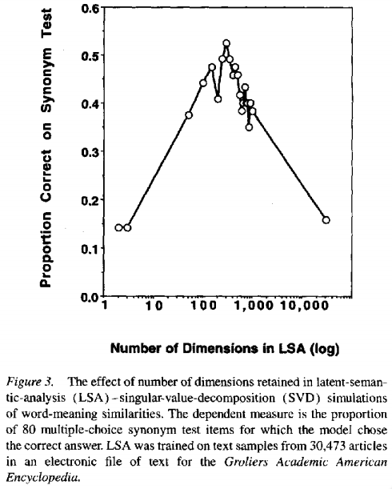
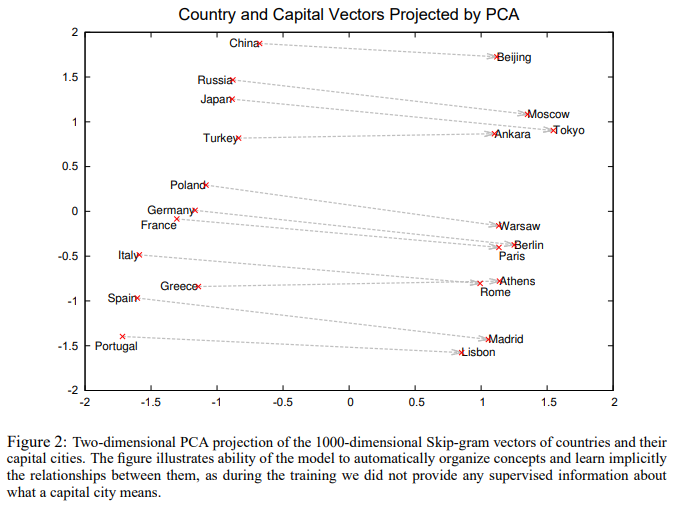

# An Quick Review of Some NLP Models

## Interpretable-NLP Talk 1
Zining Zhu

---
# Goals of Natural Language Processing
- Let machines process and understand languages like humans do.  
- Let machines help humans better understand and use languages.  
- Many more...

**My favorite viewpoint**  
NLP opens a window for automatic analysis of knowledge & intelligence.

---
# Language is a Window
- We use language to learn, store, process, and convey knowledge.  
  - We *think in* languages.  
  - Humans can do so much, by learning so little.  
- But what *is* knowledge?  
  - "True, justified belief" is too vague -- and debatable.  
  - Language is a window for understanding them.  
- Many early NLP papers were written by cognitive psychology researchers!

---
# How do humans know so much by learning so little?
**Previous framework: A Chomskian view**  
- There is a Universal Grammar that is common among languages.
  - Language learners can "unlearn the rules" from the noisy inputs.
- Maybe humans know some of these Universal rules?  
- **Counter-argument**: linguistic relativity / determinism (the Sapir-Whorf hypothesis)
  - Languages influence / determine people's ways of thinking.
 
---
# How do humans know so much by learning so little?
**Previous framework: Compositionality**  
- A bottom-up compositionality principle (Cresswell, 1973)  
  - Sentence meaning = $f(\text{meaning}_{w_1}, \text{meaning}_{w_2}, ...)$
  - $w_1$, $w_2$, ..., are the words in the sentence.
  - $f(\cdot)$: the composition function
- The top-down context principle (Wittgenstein, 1953; Fodor & LePore, 1992)  
  - Word meaning depends on where they are used.  
- More discussion at this blog: How to stop worrying about compositionality? [link](https://thegradient.pub/how-to-stop-worrying-about-compositionality-2/)

---
# How do humans know so much by learning so little?
**A computational approach**  
A Solution to Plato's Problem: The Latent Semantic Analysis Theory of Acquisition, Induction, and Representation of Knowledge [(Landauer and Dumais, 1997)](https://pcl.sitehost.iu.edu/rgoldsto/courses/concepts/landauer.pdf)  
- Intuition: the context principle  
- Goal: Learn to represent the semantics (with low-dimensional vectors) from text.

---
# Latent Semantic Analysis
**Representing words with vectors**  
1. Construct a "word-context" matrix: $X\in \mathbb{R}^{N_W\times N_C}$, where $N_W$ is the number of words (e.g., 60,000), and $N_C$ is the number of contexts they occur in (e.g., 30,000).  
2. Specify number of factor: $D$, (e.g., 300).  
3. Do an SVD on the co-occurrence matrix: $X = AB$
   where $A\in \mathbb{R}^{N_W\times D}$, $B\in \mathbb{R}^{D\times N_C}$.
4. The resulting matrix $A$ are the *low-dimensional representations*.

---
# Latent Semantic Analysis
**How useful are these representations?**  
Evaluate on 80 TOEFL synonym questions (select the synonym word from the four)

---
# Latent Semantic Analysis
**Connection to neuroscience**  
- Matrix multiplications are comparable to the message passing between axons, dendrites  
- The neural net models popularly used to simulate brain processes can be recast as matrix algebraic operations.  

Also quoting from page 8:

    We, of course, intend no claim that the mind or brain actually 
    computes a SVD on aperfectly remembered event-by-context matrix.

---
# A Neural Probabilistic Language Model
[Bengio et al., (2003)](https://dl.acm.org/doi/10.5555/944919.944966)  
- Can we compute the *word vector* without doing SVD?  
- Use neural networks!
- To train neural network: use *language modeling* task: 
  Predict the next word given previous words: $P(w_{i+1} | w_{1..i})$
- Train the neural network with back propagation.
- Evaluate with *perplexity* (exp of mean NLL loss): $\mathbb{E}_i \text{exp}\{-\text{log} P(w_{i+1} | w_{1..i})\}$

---
# A Neural Probabilistic Language Model
**Benefits**:  
- Neural network models allow parallelization.  
- Allows incorporating prior knowledge.  
- We can interpret (or even use) the word vectors.  

**Limitation**:  
- These word vectors are *static* -- each word might have multiple meanings. Can't handle this yet.  

---
# Using Word Vectors: A Traditional NLP Pipeline
[(Collobert and Weston, 2008)](https://dl.acm.org/doi/10.1145/1390156.1390177)  
- First compute the word vectors  
- Then use these low-dimensional word vectors for downstream tasks.  

---
# Word2vec
- Skip-gram [(Mikolov et al., 2013a)](https://arxiv.org/pdf/1310.4546.pdf) vs Continuous bag-of-word [(Mikolov et al., 2013b)](https://arxiv.org/pdf/1301.3781.pdf)  
  - Skip-gram: given a word, predict its neighbors  
  - CBOW: given the neighbors, predict the word  
- Use a two-layer fully-connected neural network for this task.  
  - Layer 1: `Linear(V, D)`
  - Layer 2: `Linear(D, V)`
  - V: vocabulary size (e.g., 60,000). D: "embedding" dimension (e.g., 1,000)
- Take the hidden layer output as the *word embedding*.

---
# The Promising Linear Analogy
$V_{\text{king}} - V_{\text{man}} + V_{\text{woman}} = V_{\text{queen}}$
Figure 2 from [(Mikolov et al., 2013a)](https://arxiv.org/pdf/1310.4546.pdf)  

---
# More on Linear Analogy
GloVe [(Pennington et al., 2014)](https://www.aclweb.org/anthology/D14-1162/)  
- The two methods up till now are imperfect:  
  - Global matrix factorization methods (e.g., LSA): good corpus statistics, poor on word analogy tasks.  
  - Local context-window method (e.g., word2vec): good analogy tasks, poor global statistical information  
- Goal: produce linear directions of meaning, while utilizing the corpus statistics.

---
# The GloVe Model
Let matrix $X$ measure the word-word co-occurrence counts. 
Learn word vectors $w$ and $\tilde{w}$ from the $X$ matrix:  
- Propose objective function  
  $$J=\Sigma_{i,j=1}^{V} f(X_{ij})(w_i^T\tilde{w}_j +b_i + \tilde{b}_j - \text{log }X_{ij})^2$$
- Take $w+\tilde{w}$ as the resulting vector.  
- Intuition: This formulation preserves the linear directions of word meaning.

---
# Intuitions behind the GloVe Objective
- When the linear analogy of word meaning is preserved, $J$ is minimized.
- Why? Because $\text{exp}(w_i^T\tilde{w}_j) = \frac{X_{ij}}{X_i}$.
  - This minimizes the squared loss part in $J$. 
  - The bias terms are added to prevent numerical underflow (e.g., log of 0).
- Why set up this analogy? Because:
  - If words i and j are similar (i.e., $w_i^T \tilde{w}_j$ is large), then ...
   the word j should occur frequently in i's contexts. (i.e., $\frac{X_{ij}}{X_i}$ is large)
  - The $\text{exp}(\cdot)$ is there so the math will work out.

---
# Neural Networks as Composition Functions
- LSTM or CNN can work well (to some extents).  
- Designing the models in specific manners can reach better task performances. 
    - Matrix-Vector Recursive Neural Network [(Socher et al., 2012)](https://nlp.stanford.edu/pubs/SocherHuvalManningNg_EMNLP2012.pdf) for classifying the semantic relationship and sentiments.  
    - AWD-LSTM [(Merity et al., 2017)](https://arxiv.org/abs/1708.02182): Adding weight drops + training with ASGD performs well in language modeling task.  
- Why not use the neural representations as "word vectors"?  

---
# Embedding from Language Models
- [Peters et al., (2018)](https://arxiv.org/abs/1802.05365) proposed the **ELMo** model:  
  - First pretrain a bidirectional LM (e.g., char-CNN $\rightarrow$ 3-layer LSTM).  
  - Then combine all layers into a single vector with weighted averaging.  
  - Add some regularizations and dropouts, then finetune on downstream tasks.  
- Why both attention (CNN) and recurrence (LSTM)?  
  - Attentions are fast. How about using only attentions, but deeper networks?

---
# Bidirectional Encoder Representation from Transformers
- [Devlin et al., (2019)](https://www.aclweb.org/anthology/N19-1423/) proposed the **BERT** model
  - 12/24-layer Transformer *encoder*.
  - Byte Pair Encoding ("word-piece") tokenization  
  - K/Q/V multi-headed attention, `gelu` activation, ...
  - Train with (1) masked LM, and (2) next-sentence prediction task. 
- These combinations seem arbitrary.  

---
# On Losses of Modern Language Models
[Aroca-Ouellette and Rudzicz, (2020)](https://www.aclweb.org/anthology/2020.emnlp-main.403/)  
- Considered many other pretraining tasks:
  - 7 token-level tasks, including `TF` - regression predicting the token's term frequency.
  - 7 sentence-level tasks, including `NSP` (next-sentence prediction).
  - 6 ways to combine the tasks. E.g., alternating tasks each iteration. 
- NSP doesn't work as good as other tasks. Why? 
  - Might because it is shallow.

---
# Summary
- NLP provides a window for understanding knowledge & intelligence.
- Many popular tasks and models (e.g., neural networks for language modeling) evolves along this goal.  

Next up: A Quick Review of Some Explainable AI Methods.
