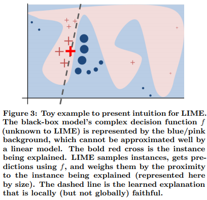
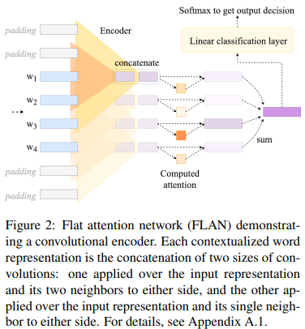

# An Quick Review of Some Explainable AI Methods

## Interpretable-NLP Talk 2
Zining Zhu

---
# The Mythos of Model Interpretability
[Lipton, (2016)](https://arxiv.org/abs/1606.03490) argued for these criteria for interpreting models:  
1. Transparency  
   - Simulatability: one can contemplate the entire model at once.  
   - Decomposability: each part of the model adopts the same explanation.
   - Algorithmic transparency  
2. Post-hoc interpretability. Some approaches include:  
   - Text or visual explanations  
   - Local explanations  
   - Explain by example  

---
# The Mythos of Model Interpretability
Possible counter-arguments to interpretability criteria:
1. Transparency
   - Simpler (e.g., linear) models are more transparent.
   - Transparency requirements might be against the model performances. 
2. Post-hoc interpretability
   - These are simplified interpretations.
   - Might be misleading.

---
# In Today's Talk
Review some popular interpretability methods:  
- Local Linear Model-agnostic Explanations (LIME)  
- SHapley Additive exPlanations (SHAP)  
- Attention-based explanations  
- Explain by CCA  

---
# Local Linear Model-agnostic Explanations (LIME)
[Ribeiro et al., (2016)](https://arxiv.org/abs/1602.04938)  
Ideas:
   - Linear models are interpretable.  
   - Complex, high-performance models $f$ are (almost) linear locally.
    $\rightarrow$ Why not fit a simple model locally?

Method:
   - Find $g$ that minimizes: $\{\mathcal{L}(f, g, \pi_x) + \Omega(g)\}$ around $x$.
   - $\mathcal{L}$ is the accuracy term. $\pi_x(\cdot)$ is a proximity measure, e.g., L2 distance.
   - $\Omega(g)$ is a complexity penalty term.

---
# Local Linear Model-agnostic Explanations (LIME)

---
# Additive Linear Models are Explanable
We can approximate a model with the following linear model with $M+1$ dimensions:
$$g(z') = \phi_0 + \Sigma_{i=1}^{M} \phi_i z_i'$$

- $z=[z_1, z_2, ..., z_M]$ is an "explanation" point that explains $x=[x_1, ..., x_M]$.
- $\phi_i$ are the *importance* of the $i^{th}$ feature.

---
# A Method to Compute Feature Importance
- There are $F$ features in total.
- What if we train (1) a model $f_{S}(\cdot)$ with a subset of $S$ features...
  And (2) another model, $f_{S\cup \{i\}}(\cdot)$ with this subset of features, *and* feature $i$...
  Take their difference (2)-(1), and average across all possible choices of $S$?
- This is the *expected* importance (i.e., Shapley value) of feature $i$:

$$\phi_i = \Sigma_{S\in F\backslash\{i\}} \frac{|S|! (|F|-|S|-1)!}{|F|!} [f_{S\cup \{i\}}(x_{S\cup \{i\}}) - f_S (x_S)]$$

---
# Attention-based Explanation
Attentions are prevalent in most deep neural models.  
- Initially built into Seq2Seq translation models:
  - So the attention maps can carry more information from source to target.
- Later widely used. E.g., self-attention for Transformers.
- [Attention is all you need](https://arxiv.org/abs/1706.03762)  
- More at [this blog](https://lilianweng.github.io/lil-log/2018/06/24/attention-attention.html)  

---
# Is Attention Interpretable?
[(Serrano and Smith, 2019)](https://arxiv.org/abs/1906.03731)

- Base model: Flat attention network
- Task: text-based classification (Yahoo, IMDB, Amazon, Yelp)

---
# Is Attention Interpretable?
1. Single out the importance of each attention (section 4).
   Mask one position in attention. See what happens:
   - Measure JS Divergence
     $\rightarrow$Attention magnitudes seem correlated to JSD
   - Mesaure how many of the model's decisions are flipped.
     $\rightarrow$Masking attentions with larger attention magnitudes cause more flips.

---
# Is Attention Interpretable?
2. Find a set of important attentions (section 5).
   E.g., Rank attentions by heuristics ("importance"). Mask them, starting from least important.
   - "importance" as attention weights, or representation values
   - "importance" as saliency scores (gradient values, or products)
   - Many other details at [(Serrano and Smith, 2019)](https://arxiv.org/abs/1906.03731)

Attentions are **noisy** predictions of input words' importances.

---
# Two Relevant Papers on Attention Explanation
**Attention is Not Explanation** [Jain and Wallace, (2019)](https://arxiv.org/abs/1902.10186)
- Attention weights uncorrelated with gradient-based measures of feature importance.

**Attention is Not Not Explanation** [Wiegreffe and Pinter, (2019)](https://arxiv.org/abs/1908.04626) 
- The above paper allows too much flexibility.

---
# Explain with CCA
- CCA: 
  Given matrices $X$ and $Y$, find vectors $a$ and $b$ to minimize $corr(a^TX, b^TY)$.
- Deep CCA [(Andrew et al., 2013)](https://ttic.uchicago.edu/~klivescu/papers/andrew_icml2013.pdf) 
  Find $f_1$ and $f_2$ that minimize $corr(f_1(X), f_2(Y))$.
- CCA / Deep CCA finds a "common view", and, more importantly:
  - How hard it is to find this "common view".  
  - This is more than just "distance between $X$ and $Y$".
- If $X$ is a known model, then we can explain $Y$ with $X$.

---
# SVCCA
[(Raghu et al., 2017)](https://arxiv.org/abs/1706.05806)
- Use SVD to go from high dimensions to low dimensions
- Then do a CCA. 
- Application: 
  - In-model comparison: different layers? components?
  - Inter-model comparison

---
# More Methods: A survey of explanability techniques for text classification
[(Atanasova et al., 2020)](https://www.aclweb.org/anthology/2020.emnlp-main.263)  
- Attribution Maps:
  - Agreement with human rationales, Confidence Indication, Faithfulness, Rationale Consistency, Dataset Consistency
- Gradient-based approaches: e.g., Saliency
- Perturbation-based approaches: e.g., Occlusion
- Simplification-based explanation: e.g., LIME

---
# How should we define and evaluate faithfulness?
[(Jacovi and Goldberg, 2020)](https://www.aclweb.org/anthology/2020.acl-main.386/)  
- Two notable criteria for XAI: plausibility and faithfulness
  - Plausibility: how convincing the interpretation is to humans.
  - Faithfulness: how accurately it reflects the model's reasoning process.
- The current definition for faithfulness has assumptions:  
  - A1: same reasoning process $\rightarrow$ the same preditions  
  - A2: similar reasoning $\rightarrow$ similar decisions given inputs  
  - A3: some parts of the input are more important than others.

---
# Manipulating and Modeling Model Interpretability
[(Poursabzi-Sangdeh et al., 2018)](https://arxiv.org/abs/1802.07810)  
- In AI: interpretability techniques include:
   (1) clear / transparency.  
   (2) post-hoc explanation.  
- Do humans really benefit from interpretability?  

---
# Manipulating and Modeling Model Interpretability
Five experiments (1/2)
- Task: predict apartments' selling price from features.  
- E1: Let participants guess how models would predict. Then show them model predictions. Then guess again.  
- E2: Scale down the selling price. Replicate E1.
- E3: Use weight of advice to measure how much people follow models' predictions.

Findings from E1-E3:  
1. Participants did *not* follow the model predictions.  
2. Participants did *not* correct the model's sizable mistakes.

---
# Manipulating and Modeling Model Interpretability
Five experiments (2/2)  
- E4: E1 setting, but show a signal: "this apartment may be an outlier"  
Finding: Participants shown this signal can detect & correct model mistakes.
- E5: Post-hoc analysis for E1&2. Participants shown clear 8-feature model followed predictions less closely (than clear-2, BB-2, and BB-8 models).
Finding: Possibly information overload?

---
# Summary
- Reviewed some principles of model interpretability.  
- Reviewed some early methods to interpret models, including:
  - A local, (almost-) linear, post-hoc method: LIME
  - A method based on Shapley values: SHAP
  - Attention-based methods
  - SVCCA
- There are many more recent methods. Will discuss them in upcoming weeks.
