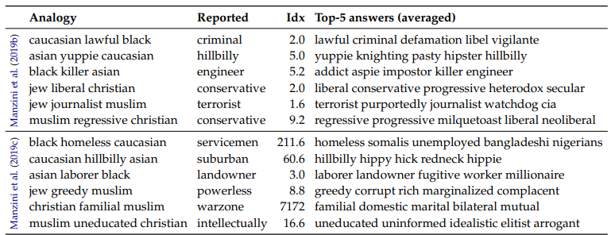
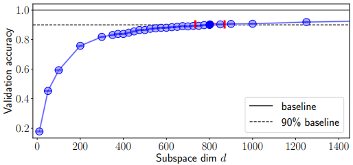
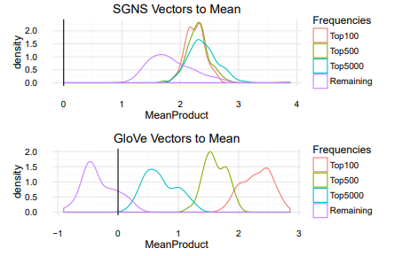
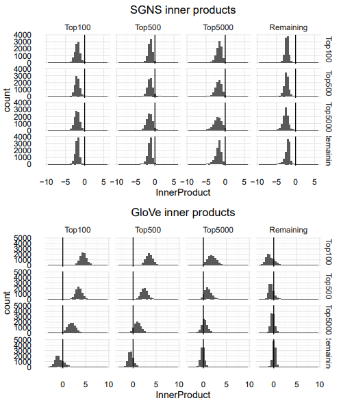
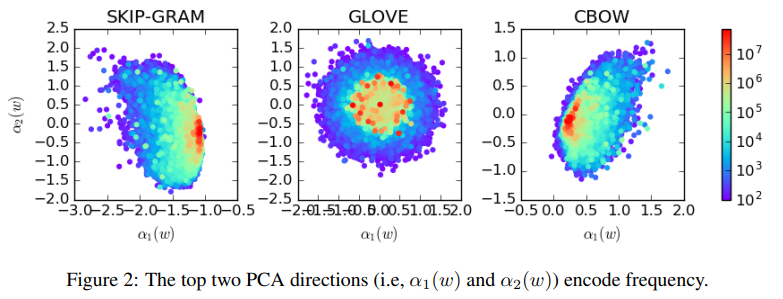

# Geometry of Latent Representations
## Interpretable-NLP Talk 3
Zining Zhu

---
# Contents
1. Two viewpoints in interpreting the geometry:
- Linear Analogy  
- Anisotropy  

2. How can we use these understanding to build better embeddings?  
- New methods could benefit old models!
- Consider frequency & isotropy might help 

---
# Recap: word2vec appeared promising
The most famous exmaple for word2vec: [(Mikolov et al., 2013a)](https://arxiv.org/pdf/1310.4546.pdf)
$$V_{\text{king}} - V_{\text{man}} + V_{\text{woman}} = V_{\text{queen}}$$  

"King, man, woman, queen" appear to encode gender bias. Other examples? 
- "Black is to Criminal as Caucasian is to Police" [(Manzini et al., 2019)](https://www.aclweb.org/anthology/N19-1062/)  

---
# But we need to be careful
In many cases, the analogy test returns just the original word. [(Nissim et al., 2019)](https://arxiv.org/abs/1905.09866)  
  

---
# Why are low-dimensional embeddings possible?
We can get ok performance with much fewer parameters. [(Li et al., 2018)](https://arxiv.org/abs/1804.08838)  

---
# The narrow cone
[(Mimno and Thompson, 2017)](https://www.cs.cornell.edu/~laurejt/papers/sgns-geometry-2017.pdf)  

- Compare word vectors (from different frequency tiers) with their means.  
- SGNS (word2vec): narrow cone.  
- GloVe: More frequent words are closer to each other.   

---
# Word-wise similarity
  
[Mimno and Thompson, (2017)](https://www.cs.cornell.edu/~laurejt/papers/sgns-geometry-2017.pdf)  
- Compare word vectors with each other.  
- SGNS word vectors are distributed "similarly" away from each other.  
- GloVe: more frequent words form a "cluster".  

---
# How contextual are contextualized embeddings?
[Ethayarajh, (2019)](https://www.aclweb.org/anthology/D19-1006/):  Use three scores to measure contextuality:  
- Self similarity: mean cos sim between different occurrences of word $w$.  
- Intra-sentence similarity: mean cos sim between different words within a sentence.  
- Max explainable variance: proportion of variance in $w$'s representations for a given layer that can be explained by the first principal component.

---
# How contextual are contextualized embeddings?
- Baselines for contextuality measures:  
  - Self similarity / intra-sentence similarity: mean cos sim of randomly sampled words.  
  - Max explainable variance: MEV from randomly sampled word representations.  
- Subtract from each measure its respective baseline.  

---
# How contextual are contextualized embeddings?

- Self similarity as example. E.g., ELMo layer 0 is essentially static.  
- More at [(Ethayarajh, 2019)](https://www.aclweb.org/anthology/D19-1006/)  

---
# Improving embedding quality
... using the lessons learned from word embeddings [(Levy and Goldberg, 2015)](https://www.aclweb.org/anthology/Q15-1016/)  
- Identify some transferable hyper-parameters:
  - Pre-processing: dynamic context window, subsampling, deleting rare words  
  - Association metric: shifted PMI, context distribution smoothing  
  - Post-processing: add context vectors, eigenvalue weighting, vector normalization
- These methods can improve old-fashion, SVD embeddings on tasks e.g., WordSim, MEN, SimLex.

---
# Frequency-Agnostic Embedding
[(Gong et al., 2018)](https://papers.nips.cc/paper/2018/file/e555ebe0ce426f7f9b2bef0706315e0c-Paper.pdf)  
- Problem: rare and frequent words are distributed faraway. 
- Solution: Use adversarial training to:
  (1) Optimize word embedding minimizing task loss $L_T$  
  (2) Optimize embedding, to minimize discriminating loss $L_D$
  (3) Optimize discriminator, to maximize $L_D$  
  where $L_D$ predicts whether a word is rare or popular.  
- Result? Better than AWD-LSTM baselines on PTB, WikiText2. Better than Transformer baselines on WMT & IWSLT.

---
# Increase the anisotropy
[(Wang et al., 2019)](http://proceedings.mlr.press/v97/wang19f/wang19f.pdf)  
Idea: inject an adversarial perturbation on word embedding vectors on softmax layer.  
  - This adversarial perturbation has a closed form solution, given the word embeddings.
  - Optimize the embeddings to maximize performance under this perturbation.

---
# The softmax layer
The softmax layer projects the $d$ dimensional vector $\mathbf{w}$ onto $V$ dimensional probabilities:  
$$\text{Softmax}(x_t, \mathbf{w}, h_t) = \frac{e^{w^T h_t}}{\Sigma_w e^{w^T h_t}}$$  
Where $h_t$ is the layer parameter. 

---
# AdvSoft perturbation
[(Wang et al., 2019)](http://proceedings.mlr.press/v97/wang19f/wang19f.pdf), continued:  
- Add an adversarial perturbation: $\mathbf{w} \rightarrow \mathbf{w} + \delta$
  - Want to maximize this perturbation: $\text{min}_{\delta}\{(\mathbf{w}+\delta)h\}$ subject to $||\delta||\leq \epsilon$  
  - So a closed form solution is $\delta = -\epsilon \frac{h}{||h||}$.
  - Empirically: (1) let $\epsilon = \alpha ||w_i||$ for each word ($\alpha$ is a hyper-parameter).  
  (2) don't backprop through $\delta$.  
  - This perturbation encourages anisotropy -- almost like a "regularizer term".  
- Simple method improves the word embedding a lot.  

---
# Post-processing word embeddings
- Subtract the mean, and the first several principal components. 
  "All but the top" [(Mu and Viswanath, 2018)](https://openreview.net/forum?id=HkuGJ3kCb)
- Intuition: make the vectors less isotropic + remove frequency information.  
  

---
# Summary
1. Two viewpoints in interpreting the geometry:
- Linear Analogy  
- Anisotropy  

2. How can we use these understanding to build better embeddings?  
- New methods could benefit old models!
- Consider frequency & isotropy might help 
