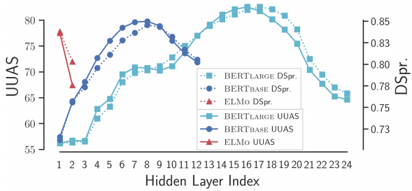
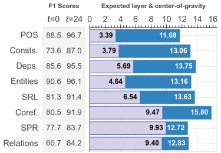
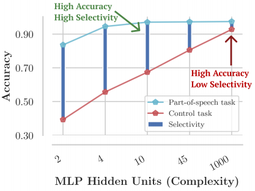
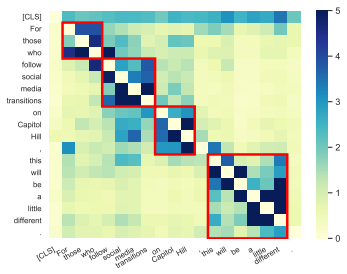
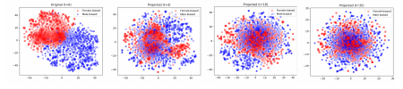
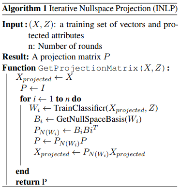

# Probing
## Interpretable-NLP Talk 4
Zining Zhu

---
# Contents
- What is probe and how to probe?
  - Probe as a diagnostic classifier
    - Probe for semantic evidence, syntax, or other aspects in NLP pipeline  
    - An information theory framework
  - Extend "probe" to e.g., without parameters  
- What can probes do?  
  - Assess & remove bias  
  - Assess the utility of features  

---
# Probing for semantic evidence: task
[Ettinger et al., (2016)](https://www.aclweb.org/anthology/W16-2524.pdf) used *simple classification tasks* to assess the specific **semantic information** captured in the sentence representations.  

**Input**: a specially crafted sentence, encoded.  
**Output**: a label.  
**Evaluation**: a good representation should allow high classification performance.

---
# Probing for semantic evidence: data
Two examples of classification tasks:  
Q1: Does this sentence contains *professor* as an **agent** of *recommend*?  
Q2: Does the *professor* in this sentence involve the act of *recommending*?  

| **Sentence** | Q1 | Q2 |
| --- | --- | --- |
| **The professor** that did not like the school recommended the researcher | TRUE | TRUE |
| **The professor** that liked the school did not recommend the researcher | TRUE | FALSE |
| The school that liked **the professor** recommended the researcher | FALSE | FALSE |

---
# Probing for semantic evidence: findings

| **Task** | GloVe (Pennington et al., 2014) | Paragram (Wieting et al., 2015) | Skip-Thought (Kiros et al., 2015) |
| --- | --- | --- | --- |
| Has-school | 100.0 | 100.0 | 100.0 |
| Has-human | 99.9 | 90.5 | 99.0 |
| School-as-agent | 47.98 | 48.57 | 91.15 |

---
# Probe as diagnostic classifiers
Language Modeling Teaches You More Syntax than Translation Does: Lessons Learned Through Auxiliary Task Analysis [(Zhang & Bowman, 2018)](https://arxiv.org/abs/1809.10040)  
- Labels:  
  - Part-Of-Speech (POS) tagging on Penn Treebank.  
  - Combinatorial Categorical Grammar (CCG) supertagging on CCG bank.  
  - "Word identity" task: take the embedding of word i (or $i\pm 1,3,5$), predict word $i$ (out of the ~1k words).  
- Task setting: probe the LSTM hidden states.  
  - The LSTMs come from LM or translation.  

---
# Probe for finding syntax in word representations
[Hewitt & Manning, 2019](https://www.aclweb.org/anthology/N19-1419/)  
- Train probes to recover the *syntactic distances* between words in sentences.  
- Vector representation $h$; probe as a linear transformation $B$.
- Sentence length $|s|$; i,j index the words in this sentence. Then:  
$$d_B(\mathbf{h_i}, \mathbf{h_j})^2 = (B(\mathbf{h_i}-\mathbf{h_j}))^T(B(\mathbf{h_i}-\mathbf{h_j}))$$
$$\text{Train probe to: }\text{min}_B \Sigma \frac{1}{|s|^2} \sum_{i,j} |d_T(w_i, w_j) - d_B(\mathbf{h_i}, \mathbf{h_j})^2|$$

---
# Probe for finding syntax in word representations
UUAS: Undirected unlabeled attachment score (higher is better)  
DSpr.: Average Spearman correlation between true & predicted distances  

---
# BERT rediscovers the classical NLP pipeline

[(Tenney et al., 2019)](https://arxiv.org/abs/1905.05950)  
**Light blue**: expected layer starting to classify correctly a label.  
**Dark blue**: "center-of-gravity" of the "ok neurons" for this label.  

Echos the *Classifical NLP pipeline*: lower level syntax -> higher layers for semantics etc.

---
# Designing and Interpreting Probes with Control Tasks
[(Hewitt & Liang, 2019)](https://www.aclweb.org/anthology/D19-1275/):   
- Traditional view: high diagnostic classification acc == rich representation  
- Question: What if the probe itself learns the task?  
- Propose to use *selectivity* to select probes.  
  - A good probe should achieve high probing acc **and low control task acc**.  
  - Selectivity: the improvement of acc from a *control task*.  
  - Control task: probe random labels.

---
# Control Tasks and Selectivity
  
[Hewitt & Liang, (2019)](https://www.aclweb.org/anthology/D19-1275/) recommended using **simple classifiers** as diagnostic probes (e.g., MLP with only 2 hidden units).  
Why? Let's give a formal explanation using information theory.  

---
# Information flow and probing
[Alain and Bengio, (2017)](https://arxiv.org/pdf/1610.01644.pdf) mentioned a viewpoint regarding information flow:  
- An intuition: as we go "up" along DNNs (from input to output):
  - Total information is lost.  
  - But useful information is largely preserved.  
- Probes, as diagnostic classifiers, essentially ask this problem:  
  `Is there information about X in this part of the model?`  
- Towards "understanding the intermediate layers using linear classifier probes".  

---
# An Information Theory Framework for Probing
[Pimentel et al., (2020)](https://www.aclweb.org/anthology/2020.acl-main.420/) presented this framework:  
- Overall goal: Approximate $I(T; R)$  
  - $T$: target / label. $R$: representation.
- Diagnostic classifiers approximate $p(T|R)$ using a parameterized $q_{\theta}(T|R)$.  
  - Probing classifier minimizes cross entropy loss $H(p,q) = -\mathbb{E}_{p}\text{log}q_\theta$
- Note that $H(T|R) = H(p,q_\theta) - \text{KL}(p||q_\theta) \leq H(p, q_\theta)$  
  - So: $I(T;R) = H(T) - H(T|R) \geq H(T) - H(p, q_\theta)$  
  - Since we approximate $H(T|R)$ using $H(p, q_\theta)$, the KL term is an error -- should be as small as possible.

---
# An Information Theory Framework for Probing
[Zhu & Rudzicz, (2020)](https://www.aclweb.org/anthology/2020.emnlp-main.744/): We can rearrange the terms, so that:  
$$H(p,q_\theta) = H(T) - I(T;R) + \text{KL}(p||q_\theta)$$  
- $H(T)$: constant. Ignore this for now.  
- A small $H(p,q_\theta)$ can be caused by either of the two reasons:  
  - A large $I(T;R)$: The representation $R$ is rich in information for the target $T$.  
  - A small $\text{KL}(p||q_\theta)$: The probe "learns the task".    
- This explains the "dichotomy" of [Hewitt & Liang, (2019)](https://www.aclweb.org/anthology/D19-1275/)!  
 

---
# An Information Theory Framework for Probing
How about the control task?  
- Control task randomizes either $R$ or $T$.  
  - This trains another probe parameters $\theta_c$: $q_{\theta_c}$ approximates $p_c(T|R)$.  
- Look at the performance increase from control task to probing task.  
  This incrementation still has error, but approximates $I(T;R)$ better:  
  $$H(p_c, q_{\theta_c}) - H(p, q_\theta) = I(T;R) - \Delta$$  
  where $\Delta = \text{KL}(p||q_\theta) - \text{KL}(p_c||q_{\theta_c}) + \text{Const}$  
- More at [Zhu & Rudzicz, (2020)](https://www.aclweb.org/anthology/2020.emnlp-main.744/) and [Pimentel et al., (2020)](https://www.aclweb.org/anthology/2020.acl-main.420/).  

---
# Probing with Minimum Description Length
[Voita and Titov, (2020)](https://www.aclweb.org/anthology/2020.emnlp-main.14/) considered probing as *a channel transmitting* from $R$ to $T$ (they used $x$ and $y$ respectively).  
- To approximate $I(T;R)$: measure the **minimum description length** (also on two tasks: the control task $x_c\rightarrow y$ minus that of the probing task $x\rightarrow y$).  
$$MDL(x\rightarrow y) = L_{model} + L_{data}$$  
- Transmit the model, as well as the data encoded with this model.
  - $L_{data}=-\mathbb{E} \text{log}_2 p(y|x)$ is the cross entropy loss.  
  - $L_{model}$ is the $KL(\beta || \alpha)$ of the model, where $\alpha$ and $\beta$ are the prior & posterior distributions of the model parameters. More at "bits-back argument" [(Hinton and von Cramp, 1993)](https://www.cs.toronto.edu/~hinton/absps/colt93.pdf) 

---
# Probing with Minimum Description Length
[Voita and Titov, (2020)](https://www.aclweb.org/anthology/2020.emnlp-main.14/) presented two methods to compute MDL:  
- Variational coding: compute $L_{data} + L_{model}$ directly.
  - $L_{data}$ is basically the cross entropy loss (NLLoss).  
  - Change the probing model to a BNN, so we can estimate KL.  
- Prequential coding: approximate MDL using area below the learning curve.  
  - Take some timesteps (e.g., 0.1%, 0.2%, ..., 50%, 100% of the dataset)  
  - Sum up the NLL at these timesteps, plus $t_1\text{log}_2 K$ (transmit the first portion using uniform code).  
- Empiriaclly: MDL is stable across choices of probe model hyper-parameters!  

---
# Information Theory and How to Probe
Summary up till now:  
- We shouldn't equate "high probing performance" with "rich knowledge in representation".  
- Instead, use the *improvement* of performance compared to the control tasks.  
  - Using acc / NLLLoss: There are still debates. Hewitt & Liang, (2019): use simpler models. Pimentel et al., (2020): use highest performing models.  
  - Voita & Titov (2020): Just use MDL. Don't need to worry about which probe to choose.  

---
# Probes Don't Have to Be Classifiers
- The meaning of `probe` is context dependent: up till now: they are classifiers.  
- Let's look at several recent other methods to "open the black boxes". Here, `probe` just means "a specified algorithm to test the models".  

---
# Probing without parameters
Perturbed Masking [(Wu et al., 2020)](https://arxiv.org/abs/2004.14786)  

- Mask a token. See its impact on the other tokens (measured by e.g., Euclidean distance)  
- Pass this impact map to downstream algorithms (e.g., dependency parsing) to get better than baseline results.  

---
# Amnestic Probing
[(Elazar et al., 2020)](https://arxiv.org/abs/2006.00995)  
- Intuition: Measure the causal impact of a feature to the task.
- Remove a feature with Iterative Null-Space Projection (Ravfogel et al., 2020). Compare the task performance changes.  
- Helps answer: "is this feature used by this task?"  

---
# Null It Out: Iterative Null-Space Projection

[(Ravfogel et al., 2020)](https://arxiv.org/abs/2004.07667)   Figure 1: t-SNE projection of GloVe vectors of the most gender-biased words after t=0,3,18 and 35 iterations of INLP. Words are colored according to being male-biased or female-biased.

---
# Null It Out: Algorithm

- The classifier from X to Z contains a null space $B$.
- Collect them. (1) Add to $P$ and (2) project $X$ onto $P$ space.  
- The eventual $X$ is clean of $Z$.

---
# Probing explains reliance on spurious features
[(Lovering et al., 2021)](https://openreview.net/forum?id=mNtmhaDkAr)   Assume there are only two features, given the input $x$:  
- $t(x)$: the label $y$ is 1 *iff* $t=1$. "True" feature.  
- $s(x)$: the other feature. "Spurious" feature.  

Consider two characteristics of a feature:  
- *Extractability*: use prequential MDL (see Voita & Titov (2020)) of the feature. (larger MDL: harder to extract)  
- *Evidence*: the proportion of $s$-only examples ($s(x)=0,t(x)=1$) in the training data. (larger evidence required: $s$ feature is "disguised" better)   

---
# Probing explains reliance on spurious features
Additionally:  
- Relative extractability: the *extractability* of the $t$ feature minus (or divide) that of the $s$ feature.  
- $s^{*}$ rate: the min percentage of *evidence* required before a fine-tuned model adopts the target feature (gets 99% F1 score).  

Finding:  
- Significant negative correlations between relative extractability and $s^{*}$ rate, for T4, BERT, RoBERTa, GPT2.  
- Not significant correlations for GloVe.  

---
# Summary
- What is probe and how to probe?
  - Probe as a diagnostic classifier
    - Probe for semantic evidence, syntax, or other aspects in NLP pipeline
    - An information theory framework
  - Extend "probe" to e.g., without parameters  
- What can probes do?  
  - Assess & remove bias  
  - Assess the utility of features  