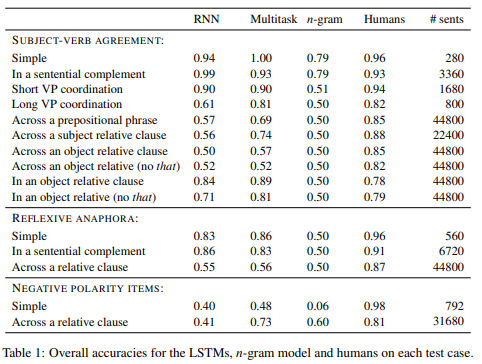

# Behavioral Testing
## Interpretable-NLP Talk 5
Zining Zhu

---
# Psycholinguistic Tests on NLP Models
- Connections of: (1) linguistic theory, (2) deep neural models.  
- Several previous works of behavioral tests.
- Directions to go forward.

---
# RNNs dream deeper than statistical patterns
Colorless green RNNs dream hierarchically [(Gulordava et al., 2018)](https://www.aclweb.org/anthology/N18-1108/)  
- Can RNNs learn to track grammatical structures?  
- Can RNNs approximate hierarchical structures?  
- Previous results didn't rule out possibilities that RNNs rely on:
  - semantic information
  - collocational / frequency-based information.

---
# Colorless green RNNs dream hierarchically
- Method: test long-distance agreement performance in:  
  - Standard corpus-extracted examples   
  - Constructed long-distance agreement benchmark
- Evaluate by accuracy (in telling the correct verb number)

---
# Long distance agreement task example
| Sentence | Subject | Verb |
| --- | --- | --- |
| the girl thinks | the girl | thinks |
| the girl [you met] thinks | the girl | thinks |
| the girl [you met yesterday] thinks | the girl | thinks |
| the girl [you met yesterday through her friends] thinks | the girl | thinks |

- The "distance" between the subject and the verb can be long.  
- There can be "attractors" (e.g., `you`, `friends`) -- words with the same POS as the cue (e.g., `girl`) but indicates different verb forms.

---
# Results

- LSTM are not much worse than humans  
- Even on nonce sentences (same morphology, but random words)

---
# BLiMP
Targeted syntactic evaluation of language models [(Marvin and Linzen, 2018)](https://www.aclweb.org/anthology/D18-1151/)  
- Automatically construct a large number of *minimally different pairs* of sentences.  
- Can be used to evaluate LMs by classification (e.g., tell apart the correct sentence).
- Let's look at some types of sentence pairs.  

---
# BLiMP: Subject-verb agreement

(The starred option is grammatically incorrect)
| Category | Sentence |
| --- | --- |
| Within a sentential complement: | The bankers knew the **officer** smiles / *smile. |
| Across a prepositional phrase: | The **farmer** near the parents smile / *smiles. |
| Across a subject relative clause: | The **officers** that love the skater smile / *smiles. |
| Multiple verbs ("VP coordination"): | The **senator** smiles and laughs / *laugh. |

---
# BLiMP: More on object relative clause

(The starred option is grammatically incorrect)
| Category | Sentence |
| --- | --- |
| Across an object relative clause: | The **farmer** that the parents love swims / *swim. |
| Within an object relative clause: | The farmer that the **parents** love / *loves swims. |
| Ignoring the "that": | The farmer the **parents** love / *loves swims. |

---
# BLiMP: Reflexive Anaphora
The anaphora should agree in number & gender with its antecedent.  
(The starred option is grammatically incorrect)
| Category | Sentence |
| --- | --- |
| Simple reflexive: | The **senators** embarrased themselves / *himself. |
| Reflexive in a sentential complement: | The bankers thought the **pilot** embarrassed himself / *themselves. |

---
# BLiMP: Negative Polarity Items
1. Words like _any_ and _ever_ can only be used within **the scope of negation**.  

Correct: **No** students have _ever_ lived here.  
Incorrect: *Most students have _ever_ lived here.  

2. The **negative noun phrase** needs to c-command the _NPI_.  

Correct: **No** authors that the security guards like have _ever_ been famous.  
Incorrect: *The authors that **no** security guards like have _ever_ been famous.  

---
# BLiMP: Experiments

- N-gram can't handle syntax across long ranges.  
- Models fail at NPI tasks (but humans can still do very well)  
- More at [Marvin and Linzen, (2018)](https://www.aclweb.org/anthology/D18-1151/)

---
# What BERT is Not
What BERT is not: Lessons from a New Suite of Psycholinguistic Diagnostics for Language Models [(Ettinger, 2020)](https://www.mitpressjournals.org/doi/full/10.1162/tacl_a_00298)  
- Previous works on LMs focused heavily on *syntactic competence* (and some semantic e.g., NPI, but still structural).  
  - Let's go beyond the syntactic focus.
- Some previous work used word prediction accuracies (e.g., LAMBADA), but they were not specific.
  - Let's be specific.

---
# CPRAG-102
Testing **c**ommonsense and **prag**matic inference.  
- Originally used in a human study by [Federmeier and Kutas (1999)](http://kutaslab.ucsd.edu/people/kutas/pdfs/1999.JML.469.pdf)  
- There are 102 total items in 34 contexts.

| Context | Expected | Incorrect |
| --- | --- | --- |
| `He complained that after she kissed him, he couldn't get the red color off his face. He finally just asked her to stop wearing that ___` | lipstick | mascara, bracelet |

---
# ROLE-88
Testing event knowledge and semantic **role** sensitivity.  
- Originally used in a human study by [Chow et al., (2016)](https://doi.org/10.1080/23273798.2015.1066832)  
- There are 120 sentences (60 pairs). Only one "context completion" is correct, but humans showed similar level of N400 signals.

| Context | Completion |
| --- | --- |
| `the restaurant owner forgot which customer the waitress had ___` | served |
| `the restaurant owner forgot which waitress the customer had ___` | served |

---
# NEG-136
Testing the understanding of the meaning of **neg**ation.
- There are 136 items in total.
  - 72 items used in human study by [Fischler et al., (1983)](http://www.coli.uni-saarland.de/courses/nondensity15/fischler83.pdf). 
  - 64 items used in human study by [Nieuwland and Kuperberg., (2008)](https://pubmed.ncbi.nlm.nih.gov/19121125/).  

| Context | Match | Mismatch | $\text{BERT}_{\text{LARGE}}$ predictions |
| --- | --- | --- | --- |
| `A robin is a ___` | bird | tree | `bird, robin, person, hunter, pigeon` |
| `A robin is not a ___` | bird | tree | `robin, bird, penguin, man, fly` |

---
# What BERT is Not: Analysis Methods
- Word prediction accuracy  
- Sensitivity testing  
- Qualitative prediction analysis  

---
# CheckList
[(Ribeiro et al., 2020)](https://www.aclweb.org/anthology/2020.acl-main.442) introduced CheckList:  

Use 3 types of task-agnostic methodology for testing NLP models.  
1. *Minimum Funtionality Test* (MFT)  
     - Simple test cases designed to target a specific behavior.
     - Generate test cases by filling *templates* 
       - E.g., `I {NEGATION} {POS_VERB} the {THING}.`  

---
# CheckList 
2. *Invariance Test* (INV)  
   - Apply some label-varying perturbations to texts. 
   - Expect the model predictions remain the same.

Some examples:
- Add randomly generated URLs and handles to tweets.  
- Swap one character with its neighbor (typo).  
- (In NER) Switching locations should not change predictions.  
   

---
# CheckList
3. *Directional Expectation test* (DIR)  
    - Perturbations to the input with known expected results.
    - Measure the robustness: the predictions should not change too much.

Example:      
Append positive (negative) phrases. Fails if sentence sentiment goes down (up) by >0.1  

---
# Good models can fail at test cases by CheckList
(Cross ref: slide 0)

- Author sentiment is more important than others'
`Some people hate you, but I think you are exceptional.` (Label: *pos*)  
Error rates: MSFT 45.4%, Googl 62.4%, Amzn 68.0%, BERT-base 38.8%  

- Correctly parse the sentences in "Question + No" forms.
`Do I think the pilot was fantastic? No.` (Label: *neg*)  
Error rates: MSFT 96.8%, Googl 90.8%, Amzn 81.6%, BERT-base 55.4%  

---
# Looking forward
How can deep learning and linguistics benefit each other?  

E.g., Discussion of [Joe Pater](https://blogs.umass.edu/phonolist/2018/10/12/pater-2019-generative-linguistics-and-neural-networks-at-60-commentaries/) and the commentaries.  
