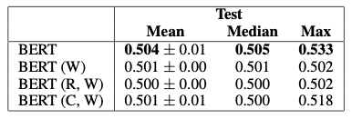
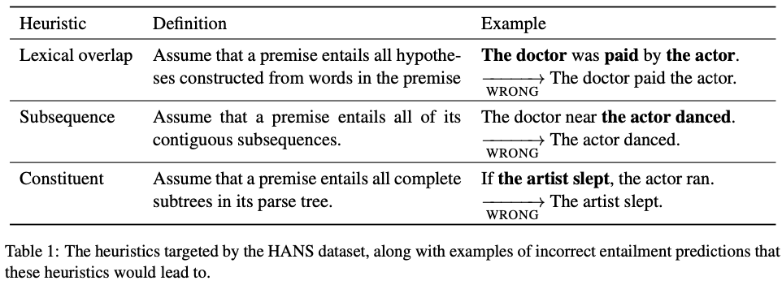
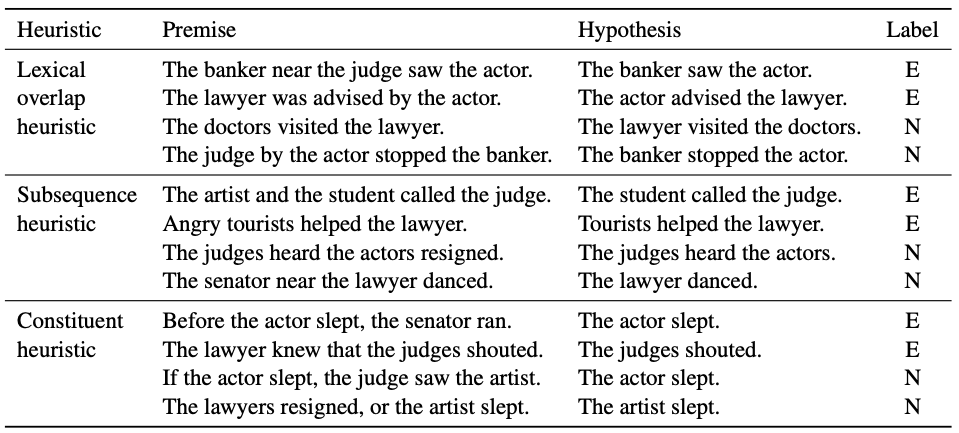
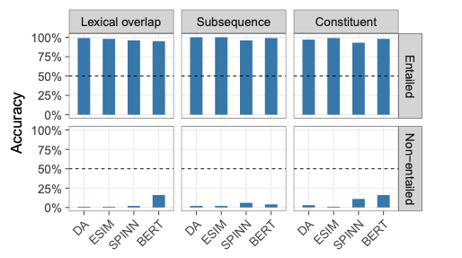
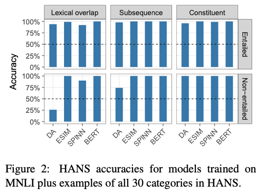
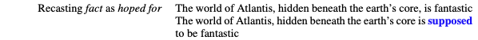
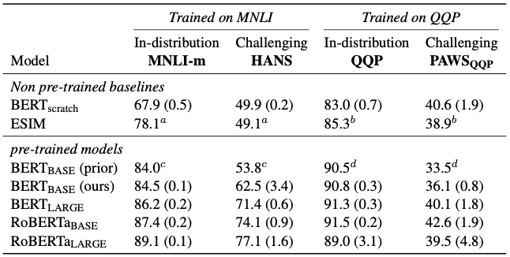
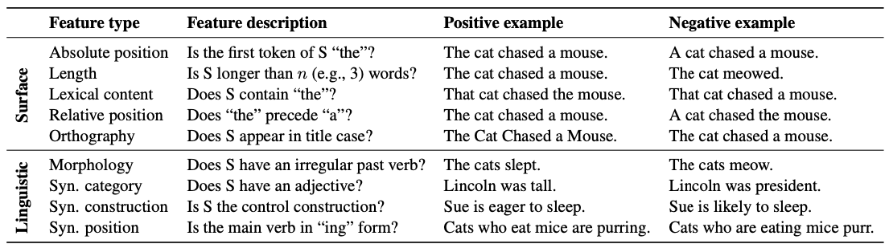
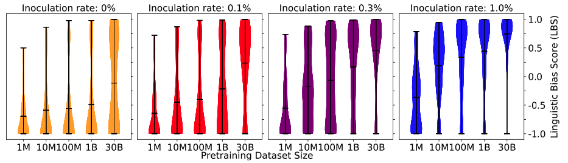

# Shortcut and Underspecification
## Interpretable-NLP Talk 6
Zining Zhu

---
# Recap: Task Performance Indicates Model Abilities
Previous ideas:  
- High accuracy $\approx$ good ability.  
- Performance can generalize across train / dev splits $\approx$ generalizable.

Both viewpoints are questionable because of shortcuts. Interpretable NLP involves understanding more about ML tasks and their generalizability.  
- This talk discuss from a model point of view: shortcut learning, underspecification, etc.  
- Next talk will be from a dataset point of view.

---
# Motivation: Probing Comprehension
[(Niven and Kao, 2019)](https://www.aclweb.org/anthology/P19-1459/) studied the Argument Reasoning Comprehension Task (ARCT):  

**Claim**: `Google is not a harmful monopoly`  
**Reason**: `People can choose not to use Google`  
**Warrant**: `Other search engines don't redirect to Google`  
**Alternative**: `All other search engines redirect to Google`  

Reason (supported by) Warrant $\rightarrow$ Claim  
Reason (supported by) Alternative $\rightarrow$ the negation of Claim.

**Goal**: Given C and R, pick W (`label=1`) over A (`label=0`).  

---
# Probing Comprehension on ARCT: Experiments

| Model | Mean accuracy | Max accuracy |
| --- | --- | --- |  
| Human (untrained) | 0.798 $\pm$ 0.16 | -- |
| BERT (large) | 0.671 $\pm$ 0.09 | 0.770 (not bad hugh?) |
| BERT (with only W as inputs) | 0.656 $\pm$ 0.05 | 0.712 (Exm? Why is this so high?) |
| BERT (with R and W as inputs) | 0.600 $\pm$ 0.10 | 0.750 (And this as well?) |
| BERT (with C and W as inputs) | 0.532 $\pm$ 0.09 | 0.732 (And this?) |

---
# Statistical Cues -- Nature of this problem?
[(Niven and Kao, 2019)](https://www.aclweb.org/anthology/P19-1459/) considered *unigrams* and *bigrams* as cues. For each cue $k$, compute its:  
- Applicability $\alpha_k$: num. data points where $k$ occurs with one label but not the other.  
- **Productivity** $\pi_k$: proportion of applicable data points predicting the correct answer.  
- **Coverage** $\xi_k=\frac{\alpha_k}{n}$: among all data points, how many cases are "applicable"?  

Eg: For the cue `not`: $\pi_k=0.61$, $\xi_k=0.64$ across the whole ARCT dataset.  
- If you just pick the sentence with `not` as W, youll be right 61% of the time. This covers 64% of the data points.

---
# Adversarial test set for ARCT
ARCT allows removing the statistical cues by generating *adversarial* test samples.  

**Original**: $R\wedge W \rightarrow C$ and $R\wedge A \rightarrow \neg C$  
**Adversarial**: Construct $C' = \neg C$, so: $R\wedge A \rightarrow C'$ and $R\wedge W \rightarrow \neg C'$.  

`C: Google is not a harmful monopoly`  
`C': Google is a harmful monopoly`

Add these additional test samples into test set: you removed the effects of statistical cues.

---
# Models perform terribly on adversarial set
  
- Good: `BERT(W)`, `BERT(R,W)` and `BERT(C,W)` results are back to 50% accuracy.  
- Bad: `BERT(R,C,W)` (i.e., `BERT`) results are down to close to 50% as well.  
- Apparently, BERT relies heavily on these statistical cues.  

---
# Another Evidence: Right For the Wrong Reasons
[McCoy et al., (2019)](https://www.aclweb.org/anthology/P19-1334/) considered the NLI task.  
- Each data sample contains a *premise* and a *hypothesis*. For example:  
   *Premise*: The judge was paid by the actor.  
   *Hypothesis*: The actor paid the judge.  

- Right for the right reason: Predict "entailment" because the *premise* **entails** the *hypothesis*.  
- Right for the wrong reason: Predict "entailment" because both sentences contain `the`（x2）, `judge`, `actor`, and `actor`.  
- This is the "lexical overlap heuristic".They identified three heuristics.  

---
# HANS heuristics

---
# HANS dataset examples

---
# HANS reveals the reliance on heuristics
  
✅ Models classified the heuristics  
❌ Models classified the true, entailment relationships (they should, but sadly they didn't)

---
# More Empirical Evidence & Formulations
This problem is also framed as:  

**Shortcut learning** [(Geirhos et al., 2020)](https://arxiv.org/abs/2004.07780)  
- The models "take the shortcut", like humans do in various psychology, education, and language exams.  

**Underspecification** [(D'Amour et al., 2020)](https://arxiv.org/abs/2011.03395)  
- The ML pipeline is *underspecified* if there are many predictors that a pipeline can return with similar risk.  
- The domain, models, etc., contain more information than what is "specified".  
  

---
# Addressing the shortcut / underspecification problem
This talk reviews some methods to address this problem.  
1. Make the training set harder.  
2. Let models handle dataset bias.  
3. Just train models on larger datasets.

---
# Method 1: Make the training set harder  
- HANS has 30 categories (3 heuristics x 10 templates).  
- Add HANS examples from all 30 categories into MNLI gets $\rightarrow$ 
  

---
# Method 1: Make the training set harder 
Counterfactually augment the data [(Kaushik et al., 2020)](https://openreview.net/forum?id=Sklgs0NFvr)  
- Instruct MTurkers to minimally change the data, to keep sentences coherent **but the labels are flipped**. Here's an example for IMDB:  

- The new dataset are harder for models -- this encourages them to *learn the difference that makes a difference*.  

---
# Method 2: Improve the models to handle dataset bias 
Learning from others' mistakes [(Sanh et al., 2020)](https://openreview.net/forum?id=Hf3qXoiNkR).    
- Assumption: small models tend to rely more on dataset bias.  
- Let a main model (let $\mathbf{m}$ be its logits) *distill* knowledge from the weak model (let $\mathbf{w}$ be its logits)  
- Product of Experts [(Hinton, 1999)](https://www.cs.toronto.edu/~hinton/absps/icann-99.pdf) can help this purpose.  

$$\mathbf{e} = \mathbf{m} + \mathbf{w}$$

After a softmax operation $\sigma(\cdot)$, it becomes an element-wise product of logits in $\mathbf{m}$ and $\mathbf{w}$:  

$$\sigma(\mathbf{e}) \propto \text{exp}(\mathbf{e}) = \text{exp}(\mathbf{m} + \mathbf{w}) = \text{exp}(\mathbf{m}) \odot \text{exp}(\mathbf{w}) \propto \sigma(\mathbf{m}) \odot \sigma(\mathbf{w})$$

---
# Product of Experts: Optimization Goal  
- Loss function: product of experts + cross entropy loss  
  - PoE loss is: $-\text{log}\sigma(\mathbf{e}) = -\text{log}\sigma(\mathbf{m}) -\text{log}\sigma(\mathbf{w})$  
  - [Clark et al., (2020)](https://www.aclweb.org/anthology/2020.findings-emnlp.272/) went with the PoE loss.  
  - [Sanh et al., (2020)](https://openreview.net/forum?id=Hf3qXoiNkR) also added the cross entropy loss.  
- In PoE: $\textbf{m}$ can *correct for* the mistakes of $\textbf{w}$.  
  - At the correct "target" (e.g., $j=0$): if $\mathbf{w}_0$ is small, then $\mathbf{m}_0$ should be large to compensate. Vice versa for the incorrect target (e.g., $j\neq 0$). 

---
# Method 2: Improve the models to handle dataset bias.  
Other methods include:  
- Unlearn Dataset Bias in NLI by Fitting the Residual [(He et al., 2019)](https://arxiv.org/abs/1908.10763)  
- End-to-End Bias Mitigation by Modelling Biases in Corpora [(Mahabadi et al., 2020)](https://www.aclweb.org/anthology/2020.acl-main.769/)  

Also referring to the debias papers in fair learning papers.

---
# Method 3: Pre-training could improve robustness
[Tu et al., (2020)](https://arxiv.org/abs/2007.06778) found some empirical evidence that pre-training improves performance on challenging test sets.  
- Tasks: MNLI (challenge set: HANS); QQP (challenge set: PAWS$_{\text{QQP}}$)  
- Models: 
  - No pretrain: BERT$_{\text{scratch}}$, ESIM  
  - Pretrained with 16GB text: BERT$_{\text{base}}$, BERT$_{\text{large}}$  
  - Pretrained with 160GB text: RoBERTa$_{\text{base}}$, RoBERTa$_{\text{large}}$  

---
# Empirical evidence: pretraining improves robustness
Some pre-training could be helpful, but this differs across tasks & models.  

---
# Learning which features matter
[Warstadt et al., (2020)](https://www.aclweb.org/anthology/2020.emnlp-main.16/) specified surface vs. linguistic features.

---
# Learning which features matter
**Inoculation experiments**  
- Add small amounts of *disambiguating data* into an otherwise ambiguous training set.  

Evaluate with **Linguistic Bias Score (LBS)**  
- Matthews correlation between model predictions and the disambiguating test set.  
- LBS=1: learner shows a systematic *linguistic* bias.  
- LBS=-1: learner shows a systematic *surface* bias.   

---
# RoBERTa learns preference for linguistic features (eventually)
Larger corpus helps RoBERTa "learn more quickly" from the disambiguating data.  

---
# Feature extractability vs. data needed in inoculation
(in `4_probing`) [Lovering et al., (2021)](https://openreview.net/forum?id=mNtmhaDkAr):  
- When a feature is harder to extract (by probing methods):  
- More disambiguating data ("evidence") is needed to learn to generalize this feature.  

---
# Summary
- The "right for the wrong reasons" problem.  
- Solving this problem:  
  - Changing dataset distributions.  
  - Let models avoid the bias.    
  - Train LMs on larger data.  
  