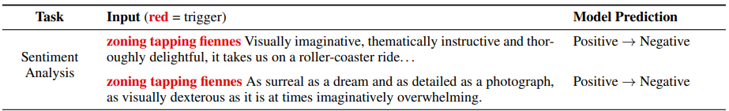

# Influence of the Datasets
## Interpretable-NLP Talk 7
Zining Zhu

---
# Motivation: quantify dataset sample influences
- Which data samples impact this trained model?  
- Start with a simple idea: perturb an input sample
  - See how much the model is surprised by this perturbation.
  - "Surprised" can be observed by e.g., activation / logit values, gradient magnitudes, prediction changes, etc.  

---
# Input marginalization
[(Kim et al., 2020)](https://arxiv.org/abs/2010.13984) What would the model predict if we replaced a word with *other possible words*?  
- This is a motivation. Let's now formalize it.  

---
# Influence functions
Understanding Black-box Predictions via Influence Functions [(Koh and Liang, 2017)](https://arxiv.org/abs/1703.04730)  
- Setup:  
  - Let us write data points as $z=\{x, y\}$  
  - Let $\hat{\theta}$ be the empirical risk minimizer: $\hat{\theta}_{z_{\text{train}}} = \text{min}_{\theta} \frac{1}{n} \Sigma_{i=1}^n L(z_i, \theta)$ 
  - When we up-weigh a training point $z$ by $\epsilon$, how is the loss $L$ impacted?
  - Note that the loss is computed using $\hat{\theta}$, which is affected by the $\epsilon$-upweighed sample.
- Overall intuition: approximate $\frac{dL}{d\epsilon}$.

---

---
# Potential issues with influence functions
Also from [Koh's slides](http://course.ece.cmu.edu/~ece739/lectures/18739-2020-spring-lecture-10-influence-functions.pdf)  
1. Computational inefficiency  
   Especially when computing inverse of the $H$ matrix.  
2. Non-smooth losses  
3. Difficulty in finding the global minimizer.

---
# Influence functions applications
Understanding the Origin of Bias in Word Embeddings [(Brunet et al., 2019)](https://arxiv.org/abs/1810.03611)  
- Word Embedding Association Test (WEAT) measures the bias in word embeddings.  
- Let $L(z_i, \theta)$ be the WEAT score.  
- Influene function $\mathcal{I}$ helps trace the source of word embedding bias.  

---
# Influence functions applications
[Han et al., (2020)](https://arxiv.org/abs/2005.06676) connected the influence function scores $\mathcal{I}$ to datasets' attributes:  

- Items with the highest $\mathcal{I}$ do affect classification performances most.  
- The $\mathcal{I}$ explanations are consistent with those from the gradient-based saliency scores.  
- HANS samples with largest abs values of $\mathcal{I}$ tend to have the highest lexical overlap rates (those with the highest "spurious correlations")  
  - But most data samples have small $|\mathcal{I}|$.

---
# Universal Adversarial Triggers
[Wallace et al., (2019)](https://arxiv.org/abs/1908.07125) found that: there are some "triggers" that we can prepend to sentences, to flip the classifiers.

---
# Anchors
[Ribeiro et al., (2018)](https://www.aaai.org/ocs/index.php/AAAI/AAAI18/paper/view/16982/15850) tried to find if-then rules that "anchor" the prediction locally.  
- Define anchor $A$ as a rule (set of predicates) such that:  
  $A(x)$ returns 1 if all its feature predicates are true for instance $x$.  
- To compute $A$ efficiently, formulate into a *combinatorial optimization* problem:  
  - Introduce a probabilistic definition: $P(\text{prec}(A)\geq \tau) \geq 1-\delta$  
  - If multiple anchors meet this criterion: choose the one with the largest *coverage*.  
  - Coverage is the probability that it applies to samples.  

---
# A theoretical framework
Adversarial Examples Are Not Bugs; They Are Features [(Ilyas et al., 2019)](https://papers.nips.cc/paper/2019/hash/e2c420d928d4bf8ce0ff2ec19b371514-Abstract.html)  
- Consider binary classification. Dataset contains $(x,y)\in \mathcal{X} \times \{\pm 1\}$.  
- Let feature be $f: \mathcal{X} \rightarrow \mathbb{R}$.  

A feature $f$ is $\rho$-useful if it is correlated with the true label: $\mathbb{E} y\cdot f(x) \geq \rho$

A feature $f$ is $\gamma$-robust if, under adversarial perturbation, $f$ remaing $\gamma$-useful:

$$\mathbb{E} \text{inf}_{\delta} \{y\cdot f(x+\delta)\} \geq \gamma$$

---
# Robust classification
[Ilyas et al., (2019)](https://papers.nips.cc/paper/2019/hash/e2c420d928d4bf8ce0ff2ec19b371514-Abstract.html)  
A robust model $C$ would minimize the cross entropy loss under adversarial perturbation:  

$$\mathbb{E}_{(x,y)} [\text{max}_\delta \mathcal{L}_\theta (x+\delta, y)]$$

Goal: construct a dataset $\mathcal{D}_R$, whose features are relevant to the robust model $C$.

Method: Process the original dataset $\mathcal{D}$ based on the trained robust model.

---
# Produce a Robust Dataset
**Input**: (1) The original dataset $\mathcal{D}$, (2) trained robust model $g_R(\cdot)$  
**Output**: A "robust" dataset $\mathcal{D}_R$. 
**Algorithm**:

    For (x,y) in D:
        Sample another x' from D
        x_R := argmin_z ||g_R(z) - g_R(x)||_2  # where each component of z is binary.
        # Solved with normalized gradient descent starting from x'
        Add (x_R, y) to the D_R set
    Return D_R

---
# Is this a robust dataset?
What they got:  
An enhanced dataset $D_R$, where:
  - The features of $g_R$ matching those *robust features* on $D$.  
  - "Feature" here refers to the activations before softmax layer.  
  - The combination of features are not considered yet.  

This is a method to *automatically* figure out the robust vs. non-robust features.

---
# Analyze the datasets
[Swayamdipta et al., (2020)](https://www.aclweb.org/anthology/2020.emnlp-main.746/)
- Training dynamics can help us understand the datasets!  
- Consider the **variability** and **confidence**
  

---
# Dataset Cartography
Consider the model probability of the true label $y_i^*$ given its input $\mathbf{x_i}$ at epoch $e$:
$$p_{\mathbf{\theta}^{(e)}} (y_i^* | \mathbf{x_i})$$

**Confidence**: the mean across epochs.

**Variability**: the spread (standard deviation) across epochs.  

For each data sample, we have the two scores -- plot confidence against variability to get the cartography.
- Can split "easy-to-learn", "hard-to-learn", and "ambiguous" data.

---
# Analyze the datasets
Distributed Shapley [(Ghorbani et al., 2020)](https://arxiv.org/pdf/2002.12334.pdf) ([blog](https://hai.stanford.edu/blog/quantifying-value-data), and a less technical version on [arxiv](https://arxiv.org/pdf/1904.02868.pdf))

Idea: 
- Shapley value $\phi$ is computed on the whole dataset
- Compute this value on a subsampled version of dataset, and take the expectation.  

---
# Dataset Condensation
[Zhao et al., (2021)](https://openreview.net/forum?id=mSAKhLYLSsl)  
Given training set $\mathcal{T}$, synthesize a small set of informative samples $\mathcal{S}$.  

1. Train $\theta^T$ on $\mathcal{T}$. Train $\theta^S$ on $\mathcal{S}$. 
2. Select $\mathcal{S}$ to minimize $D(\theta^T, \theta^S)$.  
  How? Propose two methods: parameter matching and gradient matching  
3. Repeat the above steps until stopping conditions.  

Promising results compared to traditional dataset selection ("coreset") methods.  

---
# Summary
- Perturbing the samples  
- Influence functions  
- Anchors, features, and adversarial examples  
- Studying & refining the datasets  
